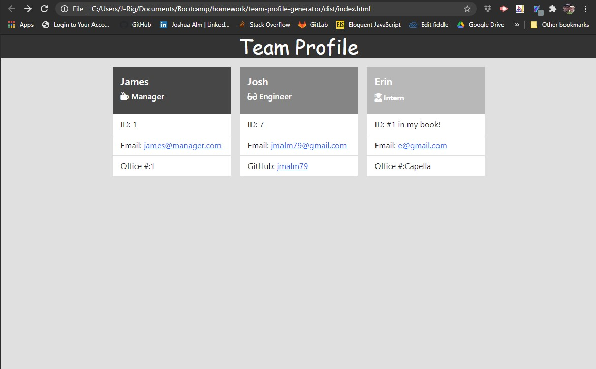

# Team Profile Generator

  []

  The Team Profile Generator runs from the terminal in VSCode, then prompts the user to enter multiple answers for Manager, Engineer & Intern Roles.

  ## Table of Contents
  * [Installation](#Installation)
  * [Usage](#Usage)
  * [License](#License)
  * [Contributing](#Contributing)
  * [Tests](#Tests)
  * [Questions](#Questions)

## Installation

Please follow these steps to ensure a proper installation. 
in VSCode, open a terminal in the team-profile-generator repo. Then enter "node index.js". 

## Usage

The following will outline the steps needed to use this project.  
You will be prompted to answer a few Questions for the Manager Role. Once finished with Manger, you will be prompted to add Engineers or Interns. You can add as many as you would like, once completed with prompts for all Employees, then select "I am finished". This will Generate an "index.html" file in the dist folder. From there, you can copy both the style.css file, and the index.html file and move them to any other repository.  

## License
The MIT License

Please follow the link to learn more about the License this project is protected under. 
[https://opensource.org/licenses/MIT](https://opensource.org/licenses/MIT)

## Contributing

How can you contribute? 
Provide Feedback, any and all feedback is welcomed if it helps further develop the project.

## Tests

The following test steps can be taken to ensure the project is running correctly. 
run npm test in the terminal. 

## Questions

Please contact me with any questions about this project. 

My GitHub URL is [https://github.com/jmalm79](https://github.com/jmalm79)

Walkthrough Video URL is [https://drive.google.com/file/d/1ifS0RXfDluuY0v2WQsJsXK0lkc5Np5az/view](https://drive.google.com/file/d/1ifS0RXfDluuY0v2WQsJsXK0lkc5Np5az/view)

Email: jmalm79@gmail.com

